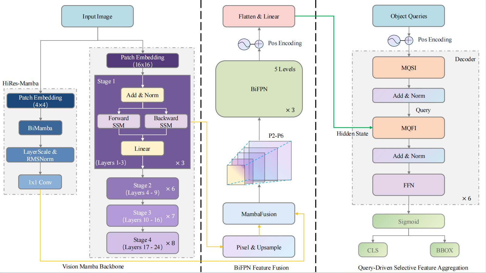
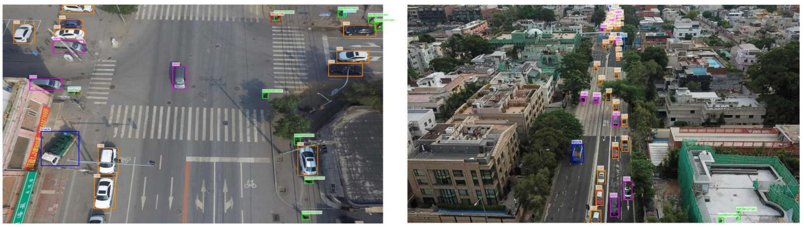

# MambaPulse

基于 Vision Mamba 的无人机航拍小目标检测框架。模型采用纯 Mamba 主干与 DETR 风格的查询解码器，在 VisDrone2019-DET 数据集上进行小目标检测。


## 方法概览



MambaPulse 由编码器和解码器两部分组成：

**编码器（`encoder.py`）**
- **ViM 主干**：基于 Vision Mamba 的 backbone，从 24 层中提取 4 个尺度的特征。
- **HiRes-Mamba 分支（`vim/hires_mamba.py`）**：高分辨率纯 Mamba 分支，对原图做 4×4 patch embedding 后经双向 Mamba 处理，提供 stride=4 的高分辨率特征，专门服务于小目标。
- **P2 融合路径**：用 PixelShuffle + 双向 Mamba 做上采样，再用纯 Mamba 模块（`MambaFusion`）融合 HiRes 分支与主干特征，全程不依赖卷积特征提取。
- **BiFPN neck**：对 5 个尺度（P2 到 P6）做加权双向特征融合。

**解码器（`model.py`）**
- DETR 风格查询解码器，使用 group queries（默认 6 组、每组 400 个查询）。
- **MQSI**：双向 Mamba 实现的查询自交互模块（替代自注意力）。
- **MQI**：双向 CrossMamba 实现的查询-特征交叉交互模块（替代交叉注意力），对每个尺度做 2D 对齐后融合。
- 每层输出分类与边界框预测，训练时使用辅助损失（aux loss）。

训练使用 Hungarian 匹配 + Focal Loss + L1/GIoU 边界框损失，支持类别平衡的 alpha 加权。

## 目录结构

```
MambaPulse/
├── encoder.py                      # 编码器：ViM 主干 + HiRes-Mamba + P-1 融合 + BiFPN
├── model.py                        # 完整模型：编码器 + 解码器
├── train.py                        # 训练脚本（VisDrone 数据集、mAP 评估）
├── mamba_block.py                  # Block / CrossBlock 包装器
├── cross_mamba.py                  # CrossMamba mixer
├── selective_scan_interface_ca.py  # CrossMamba 的 CUDA 选择性扫描接口
├── hires_mamba.py                  # HiRes-Mamba 分支
└── README.md
```

## 环境配置

`mamba-ssm` 与 `causal-conv1d` 需要编译 CUDA 算子，对 CUDA / PyTorch 版本较为敏感，版本不匹配会导致编译或运行失败。`selective_scan_interface_ca.py` 针对 `causal-conv1d 1.1.0` 的接口做了适配，使用其他版本时若报参数数量不符，需检查该文件中的 `causal_conv1d_fwd` / `causal_conv1d_bwd` 调用。

- Python: `3.10`
- CUDA: `11.8`
- PyTorch: `2.1.1`

主要依赖：

```bash
pip install torch torchvision          # 与你的 CUDA 版本匹配
pip install causal-conv1d==1.1.0       # 版本需与 selective_scan_interface_ca.py 适配
pip install mamba-ssm
pip install timm einops
pip install albumentations opencv-python scipy numpy
```

此外还需要 `selective_scan_cuda` 与 `causal_conv1d_cuda`（随 `mamba-ssm` / `causal-conv1d` 编译安装）。

## 数据集

使用 VisDrone2019-DET，按如下结构组织：

```
<data_root>/
├── VisDrone2019-DET-train/
│   ├── images/         
│   └── annotations/    
└── VisDrone2019-DET-val/
    ├── images/
    └── annotations/
```

标注沿用 VisDrone 官方格式（每行 `x,y,w,h,score,category,...`），脚本会自动忽略 `category` 为 0（ignored regions）和 11（others）的标注，其余映射为 10 个检测类别。

## 训练

```bash
python train.py \
    --data_root /path/to/visdrone \
    --batch_size 6 --grad_accum_steps 3 \
    --epochs 300 --lr 1e-4 \
    --num_queries 400 --num_groups 6 \
    --amp
```

## 实验配置与超参数 (Implementation Details)

**模型架构配置**
- **Backbone**: 采用 ViM-Tiny 配置（24层双向选择性 SSM，嵌入维度 $d=192$）。
- **统一通道数**: HiResMamba、BiFPN、解码器及检测头的通道数统一为 $d_{model}=256$。
- **HiResMamba**: 包含 4 层双向 Mamba 层，采用 $4\times4$ patch embedding，内部维度 128。
- **BiFPN**: 对 $\{P_2, P_3, P_4, P_5, P_6\}$ 这 5 个尺度的特征进行 3 轮加权双向融合。
- **解码器**: 共 $L=6$ 层，每层的 FFN 隐藏层维度为 1024。对象查询（Object Queries）初始化为 $20\times20$ 的均匀网格（$N_q=400$）。

**训练协议与超参数**
- **硬件与输入**：在单张 NVIDIA RTX 4090 上进行训练，固定输入分辨率为 $640\times 640$。
- **优化器**：AdamW，训练 300 epochs。初始学习率 $10^{-4}$，权重衰减 $10^{-4}$，前 3 个 epoch 进行线性预热（Linear Warmup），随后余弦退火（Cosine Annealing）至 $10^{-6}$。
- **分层学习率**：主干网络（$0.1\times$），HiResMamba（$2\times$），其余网络部分（$1\times$）。主干网络在前 5 个 epoch 处于冻结状态。
- **Batch Size**：有效 Batch Size 为 18（单卡 Batch Size 为 6，梯度累加步数为 3）。
- **其他设定**：梯度裁剪阈值设为 1.0；全程启用混合精度训练（AMP）；训练阶段将 $N_q=400$ 个查询划分为 $G=6$ 组进行并行 Hungarian 匹配（Group-DETR 机制）。

**损失函数权重**
- **匹配与总损失**：采用 Focal Loss ($\lambda_{cls}=2$)、L1 Loss ($\lambda_{L1}=2$) 和 GIoU Loss ($\lambda_{giou}=5$) 的加权和。
- **Focal Loss 参数**：$\alpha=0.25$ 且 $\gamma=1.5$。为缓解长尾分布，启用了基于训练集类别频率倒数平方根的动态类平衡 $\alpha$ 加权。

**常用参数**
- `--num_queries`：每组查询数，必须是完全平方数（默认 400 = 20²）。
- `--num_groups`：group queries 组数（默认 6）。
- `--img_size`：输入分辨率（默认 640）。
- `--backbone_lr_mult` / `--hires_lr_mult`：主干与 HiRes 分支相对于其余模块的学习率倍数。
- `--class_balanced`：启用基于类别频率的 Focal Loss alpha 加权。
- `--amp`：混合精度训练。


## 定性分析 (Qualitative Analysis)



在 VisDrone2019 测试集上的定性结果充分验证了 MambaPulse 在无人机视角下的两大核心优势：

1. **跨尺度鲁棒性与密集极小目标检测**
   在具有显著深度变化的倾斜航拍场景（如右图住宅区）中，MambaPulse 展现出了优异的跨尺度检测能力。模型不仅能准确定位近处占据数十像素的车辆，也能成功检测并分类远处街道上小于 10×10 像素的密集小车群。这直接得益于 **HiResMamba** 构建的 stride-4 ($P_2$) 高分辨率特征（保留了被主干网络下采样丢失的空间细节），以及 **MQFI** 的多尺度并行分支架构（确保高分辨率特征以线性复杂度无损参与特征-查询交互）。

2. **细粒度分类与隐式去重 (De-duplication)**
   在尺度差异巨大且目标密集的城市十字路口（如左图），模型能够精准区分语义相近的类别（如客货车 vs. 轿车，摩托车 vs. 自行车），甚至对仅占据少数像素的行人也能保持高召回率。此外，预测的边界框表现出极低的冗余重叠度，这证实了 **MQSI** 模块的有效性：通过双向隐藏状态的传播，MQSI 使得匹配到目标的查询能够隐式地抑制附近的其余查询，从而有效避免了对同一目标的重复预测。

## 实验结果 (Experimental Results)

### Comparative results on the UAVDT dataset
All methods are trained and evaluated at 640×640 under the COCO-style protocol. Best results are in bold.

| Method | Backbone | FLOPs (G) | Params (M) | AP (%) | AP_small (%) | AP_small^50 (%) |
| :--- | :--- | :---: | :---: | :---: | :---: | :---: |
| YOLOv8-L | CSPDarknet | 165.2 | 43.7 | 16.2 | 10.7 | - |
| YOLOv12-L | C3k2-A2C2f | 88.9 | 26.5 | 16.9 | 11.6 | - |
| Faster R-CNN | ResNet-50 | 207.1 | 69.1 | 11.0 | 8.1 | 16.8 |
| Deformable DETR | ResNet-50 | 173.5 | 40.1 | 16.9 | 11.3 | 22.1 |
| QueryDet | ResNet-50 | 212.3 | 33.9 | 17.3 | 11.5 | 22.6 |
| RT-DETR | ResNet-50 | 136.0 | 42.0 | 17.7 | 11.1 | 21.8 |
| Mamba-YOLO | ODMamba | 156.2 | 57.4 | 17.5 | 11.4 | 22.3 |
| DINO | ResNet-50 | 245.6 | 48.2 | 18.1 | 12.0 | 23.4 |
| **MambaSOD (ours)** | **ViM-T** | **187.6** | **74.9** | **18.4** | **13.1** | **25.2** |

### Algorithm efficiency on NVIDIA Jetson AGX Xavier
AP_small is reported on VisDrone2019.

| Metric | YOLOv5s | YOLOv5s+TRT | Deformable DETR | DINO | MambaSOD (ours) |
| :--- | :---: | :---: | :---: | :---: | :---: |
| Type | CNN | CNN | Transformer | Transformer | Mamba |
| FLOPs (G) | ~16 | ~16 | ~170 | ~240 | ~180 |
| Params (M) | 7.2 | 7.2 | 40.1 | 48.2 | 74.9 |
| PyTorch FPS | 8 | - | ~3.3 | ~1.2 | ~2.6 |
| TensorRT FPS (FP16) | - | ~30 | - | - | - |
| Latency (ms) | 125 | ~33 | ~303 | ~830 | ~380 |
| Peak GPU memory (GB) | 0.6 | ~0.4 | ~5.5 | ~8.0 | ~6.2 |
| AP_small (%) | 3.2 | 2.8 | 11.6 | 13.4 | 14.1 |

## 致谢

这项工作以 [Vim](https://github.com/hustvl/Vim)（Zhu等人）和[Mamba](https://github.com/state-spaces/mamba)（Gu 和 Dao）为基础。
