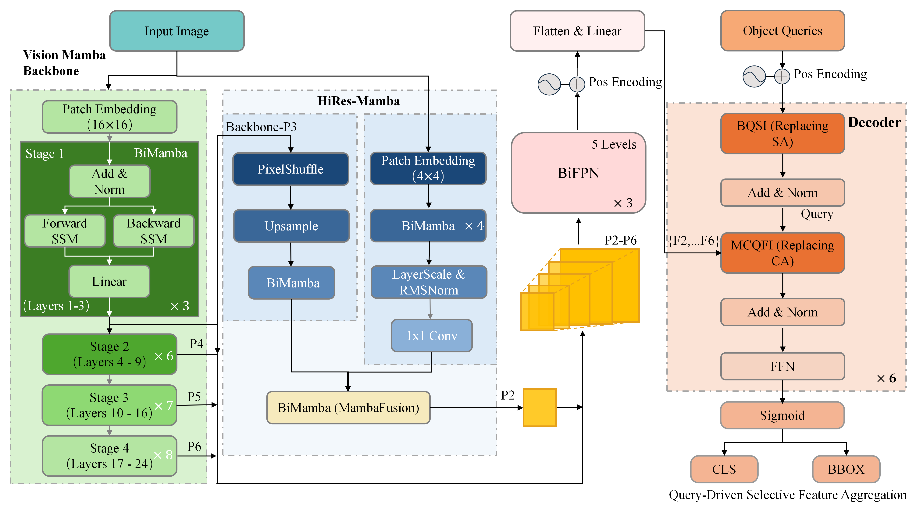
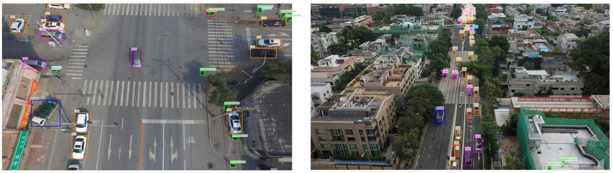

# MambaPulse

An aerial-view small-object detection framework for drones based on Vision Mamba. The model uses a pure Mamba backbone and a DETR-style query decoder for small-object detection on the VisDrone2019-DET dataset.


## Method Overview



MambaPulse consists of an encoder and a decoder:

**Encoder (`encoder.py`)**
- **ViM backbone**: A Vision Mamba-based backbone that extracts four feature scales from 24 layers.
- **HiRes-Mamba branch (`vim/hires_mamba.py`)**: A high-resolution pure Mamba branch that applies 4×4 patch embedding to the original image and then processes it with bidirectional Mamba, providing stride=4 high-resolution features specifically for small objects.
- **P2 fusion path**: Uses PixelShuffle + bidirectional Mamba for upsampling, followed by pure Mamba modules (`MambaFusion`) to fuse the HiRes branch and backbone features, without relying on convolutional feature extraction throughout the process.
- **BiFPN neck**: Performs weighted bidirectional feature fusion on five scales (P2 to P6).

**Decoder (`model.py`)**
- DETR-style query decoder using group queries (default: 6 groups, with 400 queries per group).
- **MQSI**: A query self-interaction module implemented with bidirectional Mamba, replacing self-attention.
- **MQI**: A query-feature cross-interaction module implemented with bidirectional CrossMamba, replacing cross-attention. Each scale is aligned in 2D before fusion.
- Each layer produces classification and bounding-box predictions, and auxiliary losses are used during training.

Training uses Hungarian matching, Focal Loss, and L1/GIoU bounding-box losses, with support for class-balanced alpha weighting.

## Directory Structure

```
MambaPulse/
├── encoder.py                      # Encoder: ViM backbone + HiRes-Mamba + P-1 fusion + BiFPN
├── model.py                        # Complete model: encoder + decoder
├── train.py                        # Training script (VisDrone dataset and mAP evaluation)
├── mamba_block.py                  # Block / CrossBlock wrappers
├── cross_mamba.py                  # CrossMamba mixer
├── selective_scan_interface_ca.py  # CUDA selective-scan interface for CrossMamba
├── hires_mamba.py                  # HiRes-Mamba branch
└── README.md
```

## Environment Configuration

`mamba-ssm` and `causal-conv1d` require compiled CUDA operators and are sensitive to CUDA/PyTorch versions. Version mismatches may cause compilation or runtime failures. `selective_scan_interface_ca.py` is adapted for the interface of `causal-conv1d 1.1.0`. If another version is used and an argument-count mismatch is reported, check the `causal_conv1d_fwd` / `causal_conv1d_bwd` calls in that file.

- Python: `3.10`
- CUDA: `11.8`
- PyTorch: `2.1.1`

Main dependencies:

```bash
pip install torch torchvision          # Match your CUDA version
pip install causal-conv1d==1.1.0       # Must match the interface in selective_scan_interface_ca.py
pip install mamba-ssm
pip install timm einops
pip install albumentations opencv-python scipy numpy
```

In addition, `selective_scan_cuda` and `causal_conv1d_cuda` are required. They are compiled and installed together with `mamba-ssm` / `causal-conv1d`.

## Dataset

VisDrone2019-DET is used, organized as follows:

```
<data_root>/
├── VisDrone2019-DET-train/
│   ├── images/
│   └── annotations/
└── VisDrone2019-DET-val/
    ├── images/
    └── annotations/
```

The annotations follow the official VisDrone format (each line contains `x,y,w,h,score,category,...`). The script automatically ignores annotations whose `category` is 0 (ignored regions) or 11 (others), and maps the remaining annotations to 10 detection categories.

## Training

```bash
python train.py \
    --data_root /path/to/visdrone \
    --batch_size 6 --grad_accum_steps 3 \
    --epochs 300 --lr 1e-4 \
    --num_queries 400 --num_groups 6 \
    --amp
```

## Experiment Configuration and Hyperparameters (Implementation Details)

**Model Architecture Configuration**
- **Backbone**: Uses the ViM-Tiny configuration (24-layer bidirectional selective SSM with embedding dimension $d=192$).
- **Unified channel dimension**: The channel dimension of HiResMamba, BiFPN, the decoder, and the detection heads is uniformly set to $d_{model}=256$.
- **HiResMamba**: Contains four bidirectional Mamba layers, uses $4\times4$ patch embedding, and has an internal dimension of 128.
- **BiFPN**: Performs three rounds of weighted bidirectional fusion on the five feature scales $\{P_2, P_3, P_4, P_5, P_6\}$.
- **Decoder**: Contains $L=6$ layers. The hidden dimension of each FFN is 1024. Object queries are initialized as a uniform $20\times20$ grid ($N_q=400$).

**Training Protocol and Hyperparameters**
- **Hardware and input**: Training is performed on a single NVIDIA RTX 4090 with a fixed input resolution of $640\times640$.
- **Optimizer**: AdamW is used for 300 epochs. The initial learning rate is $10^{-4}$, weight decay is $10^{-4}$, and the learning rate is linearly warmed up for the first 3 epochs, followed by cosine annealing to $10^{-6}$.
- **Layer-wise learning rates**: The backbone uses $0.1\times$, HiResMamba uses $2\times$, and the remaining modules use $1\times$ the base learning rate. The backbone is frozen for the first 5 epochs.
- **Batch Size**: The effective batch size is 18 (single-GPU batch size of 6 with 3 gradient-accumulation steps).
- **Other settings**: The gradient-clipping threshold is set to 1.0. Mixed-precision training (AMP) is enabled throughout. During training, the $N_q=400$ queries are divided into $G=6$ groups for parallel Hungarian matching using the Group-DETR mechanism.

**Loss Function Weights**
- **Matching and total loss**: A weighted sum of Focal Loss ($\lambda_{cls}=2$), L1 Loss ($\lambda_{L1}=2$), and GIoU Loss ($\lambda_{giou}=5$) is used.
- **Focal Loss parameters**: $\alpha=0.25$ and $\gamma=1.5$. To alleviate the long-tail distribution, dynamic class-balanced alpha weighting based on the inverse square root of training-set class frequencies is enabled.

**Common Parameters**
- `--num_queries`: Number of queries per group; must be a perfect square (default: 400 = 20²).
- `--num_groups`: Number of group-query groups (default: 6).
- `--img_size`: Input resolution (default: 640).
- `--backbone_lr_mult` / `--hires_lr_mult`: Learning-rate multipliers for the backbone and HiRes branch relative to the other modules.
- `--class_balanced`: Enables class-frequency-based alpha weighting for Focal Loss.
- `--amp`: Enables mixed-precision training.


## Qualitative Analysis



The qualitative results on the VisDrone2019 test set sufficiently verify the two core advantages of MambaPulse for drone-view imagery:

1. **Cross-scale robustness and dense tiny-object detection**
   In the oblique aerial scene with significant depth variation (such as the residential area on the right), MambaPulse demonstrates strong cross-scale detection capability. The model can accurately localize vehicles occupying dozens of pixels in the foreground and successfully detect and classify dense groups of small cars on distant streets, whose sizes are smaller than $10\times10$ pixels. This directly benefits from the stride-4 ($P_2$) high-resolution features constructed by **HiResMamba**, which preserve spatial details lost during backbone downsampling, and from the multi-scale parallel branch architecture of **MQFI**, which allows high-resolution features to participate in feature-query interaction without being discarded while maintaining linear complexity.

2. **Fine-grained classification and implicit de-duplication**
   In the dense urban intersection on the left, where object scales vary substantially, the model accurately distinguishes semantically similar categories (such as vans and cars, and motorcycles and bicycles) and maintains high recall for pedestrians occupying only a few pixels. In addition, the predicted bounding boxes exhibit very low redundant overlap, confirming the effectiveness of **MQSI**: through bidirectional hidden-state propagation, MQSI enables queries matched to targets to implicitly suppress nearby remaining queries, thereby effectively avoiding duplicate predictions of the same target.


## Acknowledgments

This work is based on [Vim](https://github.com/hustvl/Vim) (Zhu et al.) and [Mamba](https://github.com/state-spaces/mamba) (Gu and Dao).
